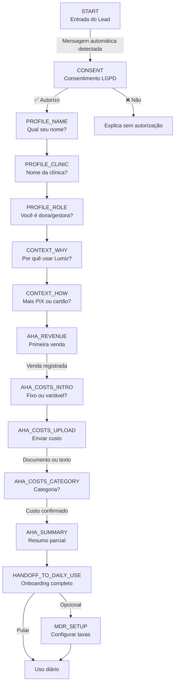

# Visualização do Novo Fluxo de Onboarding WhatsApp

## Diagrama do Fluxo Completo



## Exemplos de Conversação Completa

### 0️⃣ START - Entrada do Lead

**Usuário envia (via link do site):**
```
🔥 Quero organizar o financeiro da minha clínica com a Lumiz!
Tenho o convite para o teste gratuito!
```

**Lumiz responde:**
```
Oi! Eu sou a Lumiz 👋
Eu organizo o financeiro da sua clínica aqui no WhatsApp, sem planilhas.

Pra te mostrar como a Lumiz vira seu organizador diário de caixa, vamos
fazer um teste rápido de 3 minutos.

Posso começar?

1️⃣ Sim!
2️⃣ Como a Lumiz funciona?
```

**Se usuário escolher "2":**
```
Em 3 minutos você me manda 1 venda e 1 custo (texto, foto ou PDF).
Eu organizo tudo e já te mostro quanto entrou e quanto saiu.

Posso começar?

1️⃣ Sim!
2️⃣ Como a Lumiz funciona?
```

---

### 1️⃣ CONSENT - Consentimento LGPD

**Lumiz:**
```
Antes de começarmos: posso usar os dados que você me enviar aqui só pra organizar seu financeiro?
Você pode parar quando quiser.

1️⃣ Autorizo
2️⃣ Não
```

**Se "Não":**
```
Sem problema. Posso te explicar como funciona, mas não consigo registrar dados sem autorização.
Quer ver um exemplo de resumo?
```

---

### 2️⃣ PROFILE - Identificação

#### 2.1 Nome
**Lumiz:**
```
Pra eu te chamar direitinho: qual seu nome?
```

**Usuário:** "Maria"

#### 2.2 Nome da Clínica
**Lumiz:**
```
E o nome da sua clínica?
```

**Usuário:** "Clínica Estética Maria"

#### 2.3 Papel
**Lumiz:**
```
Você é a dona/gestora ou alguém do time?

1️⃣ Dona / gestora
2️⃣ Adm / financeiro
3️⃣ Secretária
4️⃣ Profissional (aplico)
```

**Usuário pode digitar:** "1" ou "dona" ou "gestora"

---

### 3️⃣ CONTEXT_MIN - Contexto Mínimo

#### 3.1 Por quê (ajustado de ordem)
**Lumiz:**
```
Hoje, você quer usar a Lumiz mais pra:

1️⃣ Organizar o dia a dia
2️⃣ Ter clareza do mês
3️⃣ Controlar custos
```

#### 3.2 Como
**Lumiz:**
```
Em média, sua clínica recebe mais por:

1️⃣ Mais PIX
2️⃣ Mais cartão
3️⃣ Meio a meio
```

---

### 4️⃣ AHA_REVENUE - Primeira Venda

**Lumiz:**
```
Perfeito, Maria. ✅

Etapa 1/3 — Primeira venda
Me manda uma venda real, do jeito que você lembraria. Pode ser simples.

Exemplos:
• "Botox R$ 1.200 no pix hoje"
• "Júlia fez full face, pagou R$ 15.600 / 3.000 pix + 6x cartão"
```

**Usuário:** "Júlia fez full face, pagou R$ 5.000 no cartão em 6x"

**Se faltar informação, Lumiz pergunta uma por vez:**
```
Qual foi o valor total?
```
ou
```
Foi PIX, cartão ou dinheiro?
```
ou
```
No cartão, foi parcelado em quantas vezes?
```
ou
```
Isso foi hoje ou em outra data?
```

**Após extrair dados, Lumiz confirma:**
```
Vou registrar assim:
Venda: Full face — R$ 5.000,00 — Cartão 6x — Hoje
Tá ok?

1️⃣ Tá ok
2️⃣ Ajustar
```

**Se "Tá ok":**
```
Venda registrada ✅
```

---

### 5️⃣ AHA_COSTS_INTRO - Introdução de Custos

**Lumiz:**
```
Show. Venda registrada ✅

Agora vem a parte que dá clareza de verdade: custos.

Etapa 2/3 — Primeiro custo
Esse custo é mais:

1️⃣ Fixo (todo mês)
2️⃣ Variável (depende do mês)
3️⃣ Não sei
```

**Se "Não sei":**
```
Tranquilo. É aluguel, salário, internet, insumo, fornecedor…?
```

---

### 6️⃣ AHA_COSTS_UPLOAD - Cadastro de Custo

**Se variável:**
```
Beleza — variável ✅
Me manda um custo variável.
Pode ser texto, foto ou PDF (boleto, NF, etc.).
```

**Se fixo:**
```
Perfeito — fixo ✅
Me manda um custo fixo.
Pode ser texto ou documento.
```

**Se usuário enviar documento (PDF/imagem):**
```
Recebi ✅ Vou organizar isso rapidinho.

Encontrei: R$ 2.300,00, vencimento 15/01, fornecedor XYZ.
Isso é um custo fixo ou variável?

1️⃣ Fixo
2️⃣ Variável
```

**Após processar, pergunta categoria:**
```
Pra eu organizar certinho, isso entra mais como:

1️⃣ Insumos / materiais
2️⃣ Aluguel
3️⃣ Salários
4️⃣ Marketing
5️⃣ Impostos
6️⃣ Outros
```

**Confirmação:**
```
Registrando: Variável — Insumos / materiais — R$ 2.300,00 — 15/01
Confere?

1️⃣ Confere
2️⃣ Ajustar
```

**Se "Confere":**
```
Custo registrado ✅
```

---

### 7️⃣ AHA_SUMMARY - Resumo AHA

**Lumiz:**
```
Pronto ✅

Etapa 3/3 — Seu resumo inicial

📌 Resumo parcial do mês
• Entradas: R$ 5.000,00
• Custos fixos: R$ 0,00
• Custos variáveis: R$ 2.300,00
• Saldo parcial: R$ 2.700,00

A partir de agora, a ideia é simples:
tudo que entra ou sai do seu caixa, você me manda aqui.
```

---

### 8️⃣ HANDOFF_TO_DAILY_USE - Finalização

**Lumiz:**
```
Onboarding feito ✅
Agora é só me usar no dia a dia.

Não tem regra nem formulário.
Tudo que entrar ou sair da clínica, você me manda aqui.

Exemplos:
• "Recebi 1.500 no pix hoje"
• "Paguei fornecedor 2.300"
• "Quanto entrou esse mês?"
• "O que ainda falta cair?"
• "Hoje fizemos R$ 15.000 em vendas, atendemos 10 pacientes"

Quanto mais você me usa, melhor eu entendo sua rotina —
e mais claros ficam seus números.

1️⃣ Registrar venda
2️⃣ Registrar custo
3️⃣ Ver resumo do mês
```

---

### 9️⃣ MDR_SETUP (Opcional) - Taxas da Maquininha

**Lumiz:**
```
Quer dar um próximo passo e deixar seu caixa ainda mais realista?
Posso configurar as taxas do cartão pra entender:

• quando o dinheiro cai (parcelado)
• quanto realmente cai na sua conta

1️⃣ Configurar agora
2️⃣ Pular por enquanto
```

**Se pular:**
```
Sem problema 👍
Por enquanto, vou te mostrar uma visão mais bruta das vendas no cartão.

Quando quiser configurar depois, é só dizer:
"Lumiz, quero configurar minhas taxas."
```

**Se configurar:**

**Pergunta 1:**
```
Quantas maquininhas ou bancos você usa pra receber cartão?
```

**Pergunta 2 (para cada uma):**
```
Entra no app da maquininha, abre a tabela de taxas e tira um print.
Pode me mandar aqui que registro automático.
```

**Mensagem de reforço:**
```
Assim eu consigo entender:

• que parte do dinheiro entra na hora
• que parte entra depois
• e quanto realmente cai no caixa
```

**Confirmação final:**
```
Pronto ✅
Agora seu caixa reflete melhor a realidade do dia a dia.
```

---

## Diferenças Principais do Fluxo Atual

### ✅ O que muda:

1. **Ordem das perguntas**: Contexto (por quê/como) vem ANTES do teste, não depois
2. **Teste real**: Vendas e custos são registrados de VERDADE no banco, não apenas demonstração
3. **Resumo calculado**: Mostra resumo parcial baseado em transações reais do mês
4. **Sem botões clicáveis**: Tudo por texto (números ou palavras-chave)
5. **MDR opcional**: Módulo de taxas vem DEPOIS do onboarding completo
6. **Mensagem inicial específica**: Detecta mensagem padrão do link do site

### 🔄 O que permanece:

1. **Persistência de estado**: Continua salvando estado entre reinicializações
2. **Validações flexíveis**: Aceita números e palavras-chave
3. **Escape hatch**: Opção de ajuda/falar com humano em qualquer momento
4. **Processamento de documentos**: OCR para PDFs/imagens
5. **Analytics**: Tracking de eventos em cada etapa

---

## Exemplo de Fluxo Completo (Conversação)

```
[Usuário via link do site]
🔥 Quero organizar o financeiro da minha clínica com a Lumiz!
Tenho o convite para o teste gratuito!

[Lumiz]
Oi! Eu sou a Lumiz 👋
Eu organizo o financeiro da sua clínica aqui no WhatsApp, sem planilhas.

Pra te mostrar como a Lumiz vira seu organizador diário de caixa, vamos
fazer um teste rápido de 3 minutos.

Posso começar?

1️⃣ Sim!
2️⃣ Como a Lumiz funciona?

[Usuário]
1

[Lumiz]
Antes de começarmos: posso usar os dados que você me enviar aqui só pra organizar seu financeiro?
Você pode parar quando quiser.

1️⃣ Autorizo
2️⃣ Não

[Usuário]
Autorizo

[Lumiz]
Pra eu te chamar direitinho: qual seu nome?

[Usuário]
Maria

[Lumiz]
E o nome da sua clínica?

[Usuário]
Clínica Estética Maria

[Lumiz]
Você é a dona/gestora ou alguém do time?

1️⃣ Dona / gestora
2️⃣ Adm / financeiro
3️⃣ Secretária
4️⃣ Profissional (aplico)

[Usuário]
1

[Lumiz]
Hoje, você quer usar a Lumiz mais pra:

1️⃣ Organizar o dia a dia
2️⃣ Ter clareza do mês
3️⃣ Controlar custos

[Usuário]
2

[Lumiz]
Em média, sua clínica recebe mais por:

1️⃣ Mais PIX
2️⃣ Mais cartão
3️⃣ Meio a meio

[Usuário]
3

[Lumiz]
Perfeito, Maria. ✅

Etapa 1/3 — Primeira venda
Me manda uma venda real, do jeito que você lembraria. Pode ser simples.

Exemplos:
• "Botox R$ 1.200 no pix hoje"
• "Júlia fez full face, pagou R$ 15.600 / 3.000 pix + 6x cartão"

[Usuário]
Júlia fez full face, pagou R$ 5.000 no cartão em 6x

[Lumiz]
Vou registrar assim:
Venda: Full face — R$ 5.000,00 — Cartão 6x — Hoje
Tá ok?

1️⃣ Tá ok
2️⃣ Ajustar

[Usuário]
Tá ok

[Lumiz]
Venda registrada ✅

Show. Venda registrada ✅

Agora vem a parte que dá clareza de verdade: custos.

Etapa 2/3 — Primeiro custo
Esse custo é mais:

1️⃣ Fixo (todo mês)
2️⃣ Variável (depende do mês)
3️⃣ Não sei

[Usuário]
2

[Lumiz]
Beleza — variável ✅
Me manda um custo variável.
Pode ser texto, foto ou PDF (boleto, NF, etc.).

[Usuário] [envia foto de boleto]

[Lumiz]
Recebi ✅ Vou organizar isso rapidinho.

Encontrei: R$ 2.300,00, vencimento 15/01, fornecedor XYZ.
Isso é um custo fixo ou variável?

1️⃣ Fixo
2️⃣ Variável

[Usuário]
2

[Lumiz]
Pra eu organizar certinho, isso entra mais como:

1️⃣ Insumos / materiais
2️⃣ Aluguel
3️⃣ Salários
4️⃣ Marketing
5️⃣ Impostos
6️⃣ Outros

[Usuário]
1

[Lumiz]
Registrando: Variável — Insumos / materiais — R$ 2.300,00 — 15/01
Confere?

1️⃣ Confere
2️⃣ Ajustar

[Usuário]
Confere

[Lumiz]
Custo registrado ✅

Pronto ✅

Etapa 3/3 — Seu resumo inicial

📌 Resumo parcial do mês
• Entradas: R$ 5.000,00
• Custos fixos: R$ 0,00
• Custos variáveis: R$ 2.300,00
• Saldo parcial: R$ 2.700,00

A partir de agora, a ideia é simples:
tudo que entra ou sai do seu caixa, você me manda aqui.

Onboarding feito ✅
Agora é só me usar no dia a dia.

Não tem regra nem formulário.
Tudo que entrar ou sair da clínica, você me manda aqui.

Exemplos:
• "Recebi 1.500 no pix hoje"
• "Paguei fornecedor 2.300"
• "Quanto entrou esse mês?"
• "O que ainda falta cair?"
• "Hoje fizemos R$ 15.000 em vendas, atendemos 10 pacientes"

Quanto mais você me usa, melhor eu entendo sua rotina —
e mais claros ficam seus números.

1️⃣ Registrar venda
2️⃣ Registrar custo
3️⃣ Ver resumo do mês

[Usuário]
3

[Lumiz] [mostra resumo do mês via queryHandler]
```

---

## Estados e Transições

| Estado | Entrada | Saída | Ação do Usuário |
|--------|---------|-------|-----------------|
| START | Mensagem do link | CONSENT | "1" ou "Sim!" |
| CONSENT | START | PROFILE_NAME | "1" ou "Autorizo" |
| PROFILE_NAME | CONSENT | PROFILE_CLINIC | Nome (texto) |
| PROFILE_CLINIC | PROFILE_NAME | PROFILE_ROLE | Nome da clínica |
| PROFILE_ROLE | PROFILE_CLINIC | CONTEXT_WHY | "1-4" ou palavras-chave |
| CONTEXT_WHY | PROFILE_ROLE | CONTEXT_HOW | "1-3" |
| CONTEXT_HOW | CONTEXT_WHY | AHA_REVENUE | "1-3" |
| AHA_REVENUE | CONTEXT_HOW | AHA_REVENUE_CONFIRM | Venda (texto) |
| AHA_REVENUE_CONFIRM | AHA_REVENUE | AHA_COSTS_INTRO | "1" (Tá ok) |
| AHA_COSTS_INTRO | AHA_REVENUE_CONFIRM | AHA_COSTS_UPLOAD | "1-3" (tipo) |
| AHA_COSTS_UPLOAD | AHA_COSTS_INTRO | AHA_COSTS_CATEGORY | Custo (texto/doc) |
| AHA_COSTS_CATEGORY | AHA_COSTS_UPLOAD | AHA_COSTS_CONFIRM | "1-6" (categoria) |
| AHA_COSTS_CONFIRM | AHA_COSTS_CATEGORY | AHA_SUMMARY | "1" (Confere) |
| AHA_SUMMARY | AHA_COSTS_CONFIRM | HANDOFF_TO_DAILY_USE | Automático |
| HANDOFF_TO_DAILY_USE | AHA_SUMMARY | MDR_SETUP ou FIM | "1-3" ou automático |
| MDR_SETUP | HANDOFF_TO_DAILY_USE | FIM | Opcional |

---

## Validações e Tratamento de Erros

### Validação de Respostas

- **Números**: Aceita "1", "2", "3" ou "1️⃣", "2️⃣", "3️⃣"
- **Palavras-chave**: 
  - Sim: "sim", "s", "ok", "confirmar", "tá ok", "confere", "autorizo"
  - Não: "não", "nao", "n", "cancelar", "ajustar", "corrigir"
  - Papel: "dona", "gestora", "adm", "financeiro", "secretária", "profissional"
- **Valores**: Extrai R$ X,XX de qualquer formato
- **Datas**: Se não informada, usa data atual

### Mensagens de Erro

- Uma pergunta por vez quando faltar informação
- Mensagens claras e amigáveis
- Opção de "ajuda" ou "falar com humano" sempre disponível

---

## Integrações Técnicas

### Registrar Transações Reais

- **Venda**: `transactionController.createAtendimento(userId, {...})`
- **Custo**: `transactionController.createContaPagar(userId, {...})`

### Calcular Resumo

- Buscar transações do mês atual
- Separar entradas, custos fixos e variáveis
- Calcular saldo parcial

### Processar Documentos

- Usar `documentHandler` para PDFs/imagens
- OCR para extrair valor, vencimento, fornecedor
- Validar e confirmar com usuário

---

## Próximos Passos

1. ✅ Visualização completa do fluxo
2. ⏳ Implementar copy (mensagens)
3. ⏳ Refatorar estados no flow service
4. ⏳ Integrar com transaction controller
5. ⏳ Testar fluxo completo
